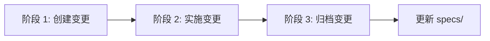
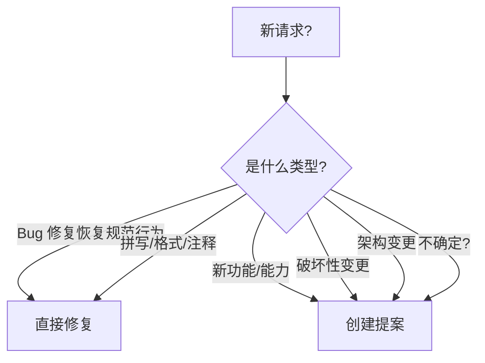

# OpenSpec 工作流程指南

> 完整的 OpenSpec 规范驱动开发工作流程参考手册

## 📋 核心概念

OpenSpec 使用三个核心目录来管理项目规范和变更:

### 目录结构说明

```
openspec/
├── specs/          # 📘 当前真相 - 已构建和部署的能力
│   └── [capability]/
│       ├── spec.md      # 需求和场景
│       └── design.md    # 技术模式(可选)
│
├── changes/        # 📝 提案 - 应该改变的内容
│   ├── [change-id]/
│   │   ├── proposal.md  # 为什么、什么、影响
│   │   ├── tasks.md     # 实施清单
│   │   ├── design.md    # 技术决策(可选)
│   │   └── specs/       # 增量变更
│   │       └── [capability]/
│   │           └── spec.md  # ADDED/MODIFIED/REMOVED
│   └── archive/    # ✅ 已完成的变更
│
└── project.md      # 项目约定和上下文
```

### 关键概念

- **`specs/`**: 代表**当前真相** - 已经构建和部署的功能
- **`changes/`**: 代表**提案** - 计划中的变更,尚未实施
- **`archive/`**: 代表**历史** - 已完成并合并到 specs 的变更

**核心原则**: Specs 是真相,Changes 是提案,保持它们同步。

---

## 🎯 三阶段工作流程

OpenSpec 遵循清晰的三阶段生命周期:



### 阶段 1: 创建变更提案

**何时创建提案:**
- ✅ 添加新功能或能力
- ✅ 进行破坏性变更(API、架构)
- ✅ 改变架构或模式
- ✅ 优化性能(改变行为)
- ✅ 更新安全模式

**何时跳过提案:**
- ❌ 修复 bug(恢复预期行为)
- ❌ 修正拼写、格式、注释
- ❌ 更新依赖(非破坏性)
- ❌ 配置变更
- ❌ 为现有行为添加测试

### 阶段 2: 实施变更

按顺序完成以下步骤(作为 TODO 跟踪):

1. **阅读 proposal.md** - 理解要构建什么
2. **阅读 design.md**(如果存在) - 审查技术决策
3. **阅读 tasks.md** - 获取实施清单
4. **按顺序实施任务** - 按顺序完成
5. **确认完成** - 在更新状态前确保 `tasks.md` 中的每一项都已完成
6. **更新清单** - 所有工作完成后,将每个任务设置为 `- [x]` 以反映实际情况
7. **批准门控** - 在提案审查和批准前不要开始实施

### 阶段 3: 归档变更

部署后,创建单独的 PR:

```bash
# 归档变更(移动到 archive/ 并更新 specs/)
openspec archive <change-id>

# 对于仅工具变更(跳过 specs 更新)
openspec archive <change-id> --skip-specs --yes

# 验证归档后的变更通过检查
openspec validate --strict
```

归档操作会:
- 移动 `changes/[name]/` → `changes/archive/YYYY-MM-DD-[name]/`
- 将增量变更合并到 `specs/` 中(除非使用 `--skip-specs`)
- 保持项目整洁和组织良好

---

## 📝 何时需要创建提案

### 决策树



### 需要提案的触发词

请求包含以下内容时考虑创建提案:
- "proposal"、"change"、"spec" **+** "create"、"plan"、"make"、"start"、"help"
- "帮助我创建变更提案"
- "帮助我规划变更"
- "我想创建规范提案"

### 不需要提案的场景

- ✅ 修复 bug - 恢复规范中定义的预期行为
- ✅ 拼写错误、格式、注释 - 不影响功能
- ✅ 依赖更新(非破坏性) - 维护活动
- ✅ 配置变更 - 不改变行为
- ✅ 为现有行为添加测试 - 验证现有规范

---

## 📁 提案结构

### 完整提案包含的文件

```
changes/[change-id]/
├── proposal.md     # 为什么、什么、影响
├── tasks.md        # 实施清单
├── design.md       # 技术决策(仅在需要时)
└── specs/          # 增量规范变更
    └── [capability]/
        └── spec.md # ADDED/MODIFIED/REMOVED
```

### Change ID 命名规范

- **格式**: kebab-case,动词开头,描述性强
- **前缀**: `add-`、`update-`、`remove-`、`refactor-`
- **示例**: 
  - ✅ `add-two-factor-auth`
  - ✅ `update-user-login`
  - ✅ `remove-legacy-api`
  - ❌ `feature1`(不描述性)
  - ❌ `Add_Feature`(格式错误)
- **唯一性**: 如果已存在,追加 `-2`、`-3` 等

---

## ✏️ 四个核心文件详解

### 1. proposal.md - 提案概述

**目的**: 解释变更的原因、内容和影响

**模板**:

```markdown
# Change: [简短描述]

## Why
[1-2 句话说明问题/机会]

## What Changes
- [变更列表]
- [用 **BREAKING** 标记破坏性变更]

## Impact
- Affected specs: [列出能力]
- Affected code: [关键文件/系统]
```

**最佳实践**:
- 保持简洁 - 聚焦于"为什么"和"什么"
- 明确标记破坏性变更
- 列出所有受影响的规范和代码区域

### 2. tasks.md - 实施清单

**目的**: 提供分步实施指南

**模板**:

```markdown
## 1. 实施
- [ ] 1.1 创建数据库架构
- [ ] 1.2 实施 API 端点
- [ ] 1.3 添加前端组件
- [ ] 1.4 编写测试

## 2. 文档
- [ ] 2.1 更新 README
- [ ] 2.2 添加 API 文档
```

**最佳实践**:
- 使用数字编号(1.1, 1.2)实现清晰的追踪
- 按逻辑执行顺序排列任务
- 包含测试和文档任务
- 任务应该是可操作的和可验证的

### 3. design.md - 技术决策(可选)

**何时需要 design.md**:

仅在以下情况创建:
- ✅ 跨领域变更(多个服务/模块)或新架构模式
- ✅ 新的外部依赖或重大数据模型变更
- ✅ 安全、性能或迁移复杂性
- ✅ 从编码前的技术决策中受益的歧义

**模板**:

```markdown
## Context
[背景、约束、利益相关者]

## Goals / Non-Goals
- Goals: [...]
- Non-Goals: [...]

## Decisions
- Decision: [什么和为什么]
- Alternatives considered: [选项 + 理由]

## Risks / Trade-offs
- [风险] → 缓解措施

## Migration Plan
[步骤、回滚]

## Open Questions
- [...]
```

### 4. specs/[capability]/spec.md - 增量变更

**目的**: 定义规范的精确变更

**必须使用增量操作标题**:
- `## ADDED Requirements` - 新能力
- `## MODIFIED Requirements` - 变更的行为
- `## REMOVED Requirements` - 弃用的功能
- `## RENAMED Requirements` - 名称变更

---

## 🔄 增量操作详解

### ADDED Requirements

用于引入新能力或子能力,可以作为需求独立存在。

**示例**:

```markdown
## ADDED Requirements

### Requirement: 双因素认证
用户在登录期间必须提供第二因素。

#### Scenario: 需要 OTP
- **WHEN** 提供有效凭证
- **THEN** 需要 OTP 挑战
```

**何时使用 ADDED**:
- 添加全新功能
- 变更是正交的(例如,添加"斜杠命令配置")
- 不改变现有需求的语义

### MODIFIED Requirements

用于改变现有需求的行为、范围或验收标准。

**重要**: 始终粘贴完整的更新后的需求内容(标题 + 所有场景)。归档器将用你在此提供的内容替换整个需求;部分增量会丢失以前的详细信息。

**正确编写 MODIFIED 需求**:

1. 在 `openspec/specs/<capability>/spec.md` 中定位现有需求
2. 复制整个需求块(从 `### Requirement: ...` 到其场景)
3. 粘贴到 `## MODIFIED Requirements` 下并编辑以反映新行为
4. 确保标题文本完全匹配(空格不敏感)并保留至少一个 `#### Scenario:`

**示例**:

```markdown
## MODIFIED Requirements

### Requirement: 用户登录
系统必须使用电子邮件和密码对用户进行身份验证,
并且必须在 3 次失败尝试后要求双因素认证。

#### Scenario: 基本登录成功
- **WHEN** 提供有效的电子邮件和密码
- **THEN** 返回 JWT 令牌

#### Scenario: 3 次失败后需要 2FA
- **WHEN** 用户在 3 次尝试后登录
- **THEN** 需要双因素认证
```

**常见陷阱**: 使用 MODIFIED 添加新关注点而不包括以前的文本。这会在归档时导致详细信息丢失。如果你没有明确改变现有需求,请改为在 ADDED 下添加新需求。

### REMOVED Requirements

用于弃用功能。

**示例**:

```markdown
## REMOVED Requirements

### Requirement: 旧版 API 端点
**Reason**: 被 v2 API 取代
**Migration**: 使用新的 `/api/v2/auth` 端点
```

### RENAMED Requirements

仅当名称改变时使用。如果你也改变行为,使用 RENAMED(名称)加上 MODIFIED(内容)引用新名称。

**示例**:

```markdown
## RENAMED Requirements
- FROM: `### Requirement: Login`
- TO: `### Requirement: User Authentication`
```

---

## 🚨 关键格式要求

### Scenario 格式化(关键)

**正确** ✅ (使用 #### 标题):

```markdown
#### Scenario: 用户登录成功
- **WHEN** 提供有效凭证
- **THEN** 返回 JWT 令牌
```

**错误** ❌ (不要使用项目符号或粗体):

```markdown
- **Scenario: 用户登录**  ❌
**Scenario**: 用户登录     ❌
### Scenario: 用户登录      ❌
```

### Requirement 措辞

- 使用 **SHALL/MUST** 表示规范性需求
- 避免 should/may,除非有意为非规范性

### 每个需求必须有至少一个场景

**正确** ✅:

```markdown
### Requirement: 用户注销
系统必须在注销时清除会话。

#### Scenario: 成功注销
- **WHEN** 用户点击注销
- **THEN** 会话被清除
```

**错误** ❌:

```markdown
### Requirement: 用户注销
系统必须在注销时清除会话.
<!-- 缺少场景! -->
```

---

## 🔨 实施步骤

### 完整的工作流脚本

```bash
# 1) 探索当前状态
openspec spec list --long
openspec list
# 可选的全文搜索:
# rg -n "Requirement:|Scenario:" openspec/specs
# rg -n "^#|Requirement:" openspec/changes

# 2) 选择 change id 并搭建脚手架
CHANGE=add-two-factor-auth
mkdir -p openspec/changes/$CHANGE/specs/auth
printf "## Why\n...\n\n## What Changes\n- ...\n\n## Impact\n- ...\n" > openspec/changes/$CHANGE/proposal.md
printf "## 1. Implementation\n- [ ] 1.1 ...\n" > openspec/changes/$CHANGE/tasks.md

# 3) 添加增量(示例)
cat > openspec/changes/$CHANGE/specs/auth/spec.md << 'EOF'
## ADDED Requirements
### Requirement: 双因素认证
用户在登录期间必须提供第二因素。

#### Scenario: 需要 OTP
- **WHEN** 提供有效凭证
- **THEN** 需要 OTP 挑战
EOF

# 4) 验证
openspec validate $CHANGE --strict
```

### 不同模式的角色

在实施期间,不同的模式有特定的角色:

- **Architect 模式**: 创建提案、规划、设计
  - 限制: 只能编辑 `.md` 文件
  - 聚焦: 规划和文档
  
- **Code 模式**: 实施代码变更
  - 聚焦: 编写、修改、重构代码
  - 使用 `tasks.md` 作为指南
  
- **Debug 模式**: 故障排除和诊断
  - 聚焦: 调查错误、添加日志
  
- **Test Engineer 模式**: 编写和调试测试
  - 聚焦: 测试覆盖率、测试失败

---

## 📦 归档流程和命令

### 何时归档

变更完全部署并验证后:

1. 所有 `tasks.md` 项都标记为 `[x]`
2. 功能在生产环境中运行
3. 测试通过
4. 文档已更新

### 归档命令

```bash
# 标准归档(更新 specs 并移动到 archive)
openspec archive <change-id>

# 非交互式归档(用于脚本/CI)
openspec archive <change-id> --yes

# 仅工具变更的归档(跳过 specs 更新)
openspec archive <change-id> --skip-specs --yes

# 归档后验证
openspec validate --strict
```

### 归档做什么

1. **移动变更**: `changes/[name]/` → `changes/archive/YYYY-MM-DD-[name]/`
2. **更新 specs**(除非使用 `--skip-specs`):
   - 将 ADDED 需求合并到 `specs/[capability]/spec.md`
   - 用 MODIFIED 内容替换现有需求
   - 删除 REMOVED 需求
   - 应用 RENAMED 操作
3. **保留历史**: 归档的变更保留以供参考

---

## 💡 实用技巧

### 搜索和导航

```bash
# 列出所有规范
openspec spec list --long

# 列出活动变更
openspec list

# 显示特定规范
openspec show <spec-id> --type spec

# 显示特定变更
openspec show <change-id>

# 仅显示增量
openspec show <change-id> --json --deltas-only

# 全文搜索(使用 ripgrep)
rg -n "Requirement:|Scenario:" openspec/specs
rg -n "^#|Requirement:" openspec/changes
```

### 验证命令

```bash
# 验证特定变更
openspec validate <change-id>

# 严格验证(推荐)
openspec validate <change-id> --strict

# 批量验证模式
openspec validate

# 调试增量解析
openspec show <change-id> --json | jq '.deltas'

# 检查特定需求
openspec show <spec-id> --json -r 1
```

### 命令标志参考

| 标志 | 目的 | 使用场景 |
|------|------|----------|
| `--json` | 机器可读输出 | 脚本、调试 |
| `--type change\|spec` | 消除歧义项 | 当名称冲突时 |
| `--strict` | 全面验证 | 提交前始终使用 |
| `--no-interactive` | 禁用提示 | CI/CD 流水线 |
| `--skip-specs` | 归档时不更新规范 | 仅工具变更 |
| `--yes`/`-y` | 跳过确认提示 | 自动化脚本 |

---

## 📚 快速参考

### 命令速查

```bash
# 基本命令
openspec list                  # 正在进行什么?
openspec show [item]           # 查看详细信息
openspec validate --strict     # 是否正确?
openspec archive <change-id> [--yes|-y]  # 标记完成

# 项目管理
openspec init [path]           # 初始化 OpenSpec
openspec update [path]         # 更新指令文件

# 调试
openspec show [change] --json --deltas-only
openspec validate [change] --strict
```

### 文件用途

| 文件 | 目的 | 何时编辑 |
|------|------|----------|
| `proposal.md` | 为什么和什么 | 创建变更时 |
| `tasks.md` | 实施步骤 | 创建变更时,实施期间更新 |
| `design.md` | 技术决策 | 仅在复杂变更时 |
| `spec.md` | 需求和行为 | 定义能力或增量时 |

### 阶段指示器

| 位置 | 含义 | 状态 |
|------|------|------|
| `changes/` | 已提案,尚未构建 | 🟡 进行中 |
| `specs/` | 已构建和部署 | 🟢 活动 |
| `archive/` | 已完成的变更 | ⚪ 历史 |

### Change ID 命名规范

```bash
# 好的示例
add-two-factor-auth
update-user-profile
remove-legacy-endpoint
refactor-auth-module

# 不好的示例
feature1                # 不描述性
Add_Feature            # 格式错误
user_auth_update       # 使用下划线而不是连字符
```

---

## 🤝 与 AI 助手协作的最佳实践

### 在任何任务之前

**上下文清单**:
- [ ] 阅读 `specs/[capability]/spec.md` 中的相关规范
- [ ] 检查 `changes/` 中的待处理变更是否有冲突
- [ ] 阅读 `openspec/project.md` 了解约定
- [ ] 运行 `openspec list` 查看活动变更
- [ ] 运行 `openspec list --specs` 查看现有能力

**在创建规范之前**:
- 始终检查能力是否已存在
- 优先修改现有规范而不是创建重复项
- 使用 `openspec show [spec]` 审查当前状态
- 如果请求模糊,在搭建脚手架前询问 1-2 个澄清问题

### 创建提案时

1. **首先探索**: 运行 `openspec spec list --long` 和 `openspec list`
2. **检查冲突**: 搜索可能冲突的现有变更
3. **选择好的 ID**: 使用 kebab-case,动词开头,描述性强
4. **完整的文件**: 创建 proposal.md、tasks.md 和增量规范
5. **始终验证**: 在分享前运行 `openspec validate <id> --strict`

### 实施变更时

1. **阅读所有内容**: proposal.md → design.md → tasks.md
2. **按顺序工作**: 遵循 tasks.md 的顺序
3. **跟踪进度**: 更新 tasks.md 中的复选框
4. **定期验证**: 运行 `openspec validate --strict`
5. **等待批准**: 在批准前不要开始实施

### 归档变更时

1. **确认完成**: 所有任务都标记为 `[x]`
2. **运行归档**: `openspec archive <change-id>`
3. **验证结果**: `openspec validate --strict`
4. **审查 specs**: 检查 specs/ 是否正确更新

---

## ❓ 常见问题排查

### "变更必须至少有一个增量"

**原因**: `changes/[name]/specs/` 不存在或没有 .md 文件

**解决方案**:
1. 检查 `changes/[name]/specs/` 是否存在
2. 验证文件有操作前缀(`## ADDED Requirements`)
3. 确保至少有一个 `specs/[capability]/spec.md` 文件

### "需求必须至少有一个场景"

**原因**: 场景格式不正确

**解决方案**:
1. 检查场景使用 `#### Scenario:` 格式(4 个井号)
2. 不要对场景标题使用项目符号或粗体
3. 每个需求至少有一个场景

**正确格式**:
```markdown
### Requirement: 用户登录
系统必须对用户进行身份验证。

#### Scenario: 登录成功
- **WHEN** 提供有效凭证
- **THEN** 返回令牌
```

### "静默场景解析失败"

**原因**: 场景格式不完全正确

**解决方案**:
1. 确保精确格式: `#### Scenario: Name`
2. 使用以下方法调试: `openspec show [change] --json --deltas-only`
3. 检查额外的空格或特殊字符

### 验证失败

**调试步骤**:
1. 使用 `--strict` 标志运行: `openspec validate [change] --strict`
2. 检查 JSON 输出的详细信息: `openspec show [change] --json`
3. 验证规范文件格式
4. 确保场景正确格式化
5. 检查需求措辞(使用 SHALL/MUST)

### 变更冲突

**处理步骤**:
1. 运行 `openspec list` 查看活动变更
2. 检查重叠的规范
3. 与变更所有者协调
4. 考虑合并提案

### 缺失上下文

**恢复步骤**:
1. 首先阅读 project.md
2. 检查相关规范
3. 审查最近的归档
4. 寻求澄清

---

## 📖 附录

### 能力命名约定

- 使用 verb-noun: `user-auth`、`payment-capture`
- 每个能力单一目的
- 10 分钟可理解性规则
- 如果描述需要 "AND",则拆分

### 多能力示例

当一个变更影响多个能力时:

```
openspec/changes/add-2fa-notify/
├── proposal.md
├── tasks.md
└── specs/
    ├── auth/
    │   └── spec.md   # ADDED: 双因素认证
    └── notifications/
        └── spec.md   # ADDED: OTP 电子邮件通知
```

### 工具选择指南

| 任务 | 工具 | 原因 |
|------|------|------|
| 按模式查找文件 | Glob | 快速模式匹配 |
| 搜索代码内容 | Grep/ripgrep | 优化的正则表达式搜索 |
| 读取特定文件 | Read | 直接文件访问 |
| 探索未知范围 | Task | 多步骤调查 |

### 简单性优先原则

- 默认 <100 行新代码
- 单文件实现,直到证明不足
- 避免没有明确理由的框架
- 选择无聊的、经过验证的模式

**仅在以下情况添加复杂性**:
- 性能数据显示当前解决方案太慢
- 具体的规模要求(>1000 用户,>100MB 数据)
- 需要抽象的多个经过验证的用例

---

## 🎓 最佳实践总结

### DO ✅

- ✅ 始终在创建规范前检查现有能力
- ✅ 使用描述性的 kebab-case change ID
- ✅ 为每个需求编写至少一个场景
- ✅ 在提交前使用 `--strict` 验证
- ✅ 保持提案简洁和集中
- ✅ 按顺序遵循 tasks.md
- ✅ 在归档前确认所有任务完成
- ✅ 使用 SHALL/MUST 表示需求
- ✅ 保持 specs/ 和 changes/ 同步

### DON'T ❌

- ❌ 不要在未验证的情况下创建规范
- ❌ 不要对场景标题使用项目符号
- ❌ 不要在没有所有先前文本的情况下使用 MODIFIED
- ❌ 不要在批准前开始实施
- ❌ 不要在没有更新 tasks.md 的情况下归档
- ❌ 不要创建重复的能力
- ❌ 不要跳过验证步骤
- ❌ 不要对简单变更使用复杂的设计
- ❌ 不要忘记为变更编写测试

---

## 🔗 相关资源

- **OpenSpec 代理指令**: [`openspec/AGENTS.md`](openspec/AGENTS.md)
- **项目上下文**: [`openspec/project.md`](openspec/project.md)
- **活动变更**: 运行 `openspec list`
- **现有规范**: 运行 `openspec list --specs`

---

**记住**: Specs 是真相。Changes 是提案。保持它们同步。

完成一个变更的完整周期:
1. **创建** - 编写清晰的提案和增量
2. **实施** - 遵循 tasks.md,按顺序
3. **归档** - 合并到 specs/,保持整洁

祝你用 OpenSpec 构建愉快! 🚀